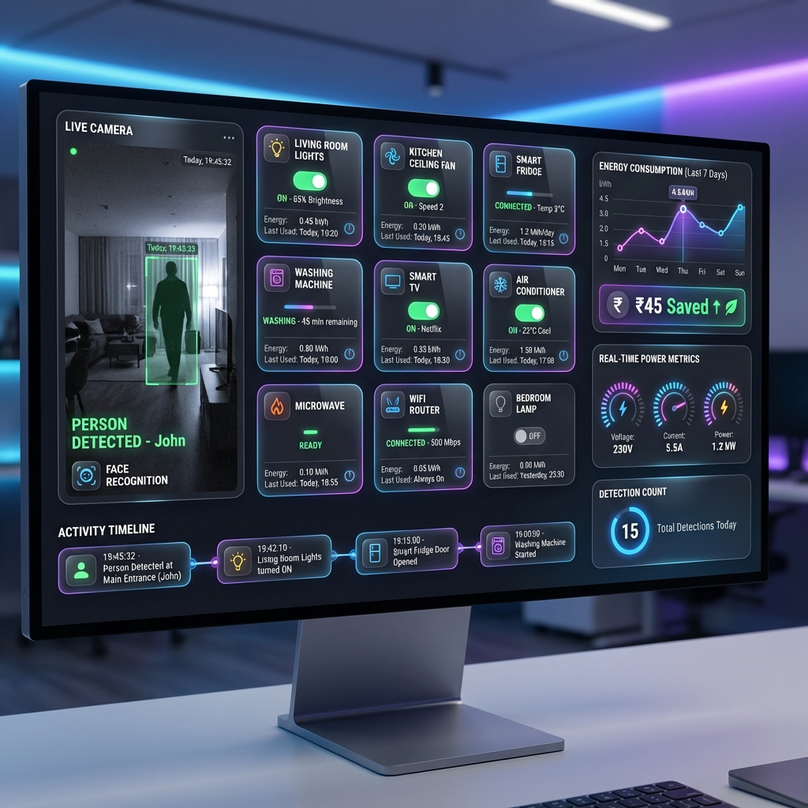
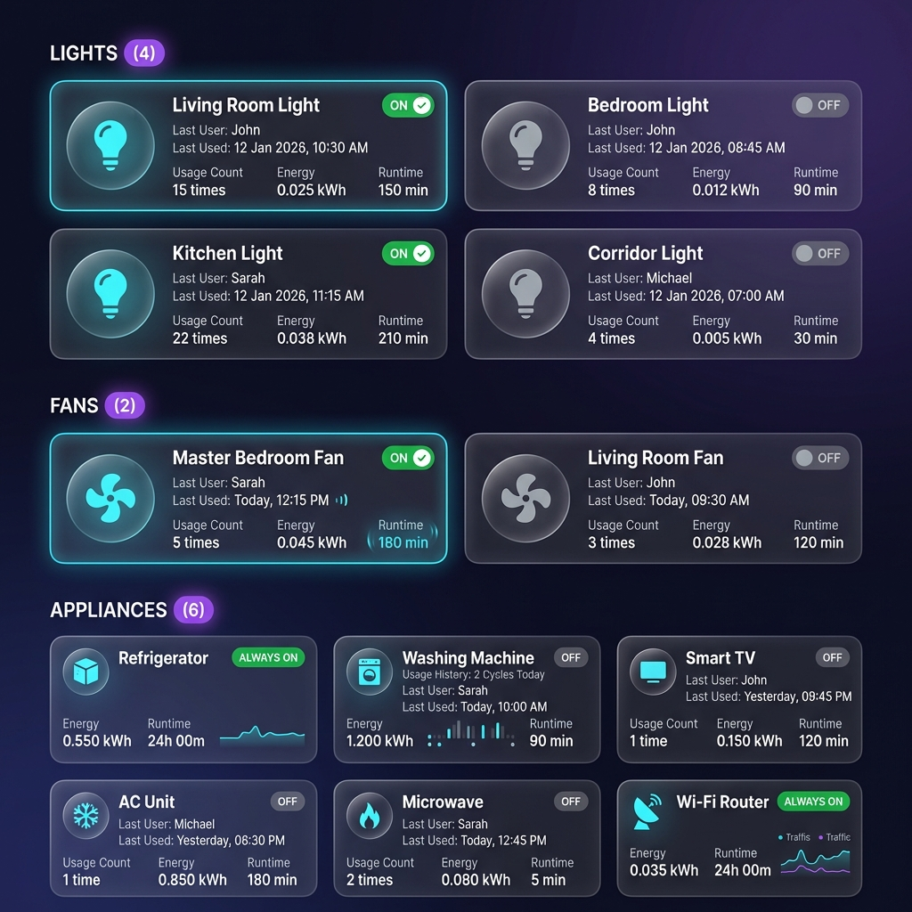

# 📸 Smart Automation System - Visual Gallery

## Complete System Showcase

This document showcases all the visual previews of the Smart Power Saving Automation System with enhanced tracking capabilities.

---

## 🖥️ Main Dashboard



**Features Shown:**
- ✅ Live camera feed with AI person detection
- ✅ Real-time bounding boxes and face recognition
- ✅ 12 smart device cards (Lights, Fans, Appliances)
- ✅ Energy analytics with graphs
- ✅ Money saved indicator (₹45 Saved)
- ✅ Activity timeline at bottom
- ✅ Real-time power metrics
- ✅ Detection count: 15 detections today

**Visual Elements:**
- Dark purple-blue gradient background
- Glassmorphism card effects
- Neon cyan/purple accent colors
- Modern typography (Inter font)
- Smooth shadows and animations

---

## 📊 Device Usage Tracking Dashboard



**Features Shown:**

### 💡 Lights Section (4 devices)
- Living Room Light - ON - John - 15 times used
- Kitchen Light - ON - Sarah - 22 times used  
- Bedroom Light - OFF - John - 8 times used
- Corridor Light - OFF - Michael - 4 times used

### 🌀 Fans Section (2 devices)
- Master Bedroom Fan - ON - Sarah - 5 times used
- Living Room Fan - OFF - John - 3 times used

### 🏠 Appliances Section (6 devices)
- Refrigerator - ALWAYS ON - 240+ min runtime
- Washing Machine - OFF - Sarah - 1.200 kWh
- Smart TV - OFF - John - 1 time used
- AC Unit - OFF - Michael - 1 time used
- Microwave - OFF - Sarah - 2 times used
- WiFi Router - ALWAYS ON - Mini graph showing uptime

**Tracking Data Displayed:**
- 👤 Last User name
- 📅 Last Used date & time
- 🔢 Usage Count (number of times used)
- ⚡ Energy consumption in kWh
- ⏱️ Total runtime in minutes
- 🟢/🔴 Real-time ON/OFF status
- 📊 Mini energy graphs for always-on devices

**Design Features:**
- Category-based organization (Lights, Fans, Appliances)
- Device count badges (e.g., "Lights (4)")
- Color-coded status indicators
- Glassmorphism glass cards
- Subtle hover effects
- Responsive grid layout

---

## 🎯 Key Visual Design Elements

### Color Palette
```
Primary Background:   #0f0f1e (Deep purple-black)
Secondary Background: #1a1a2e (Dark purple-gray)
Card Background:      rgba(255, 255, 255, 0.05) (Translucent white)

Accent Colors:
- Cyan:    #4facfe (Active/ON indicators)
- Purple:  #9b59b6 (Headers, highlights)
- Green:   #00f2fe (Success states)
- Orange:  #ff6b6b (Warnings)
- Gray:    #6c757d (OFF states)

Text Colors:
- Primary:   #ffffff (Main text)
- Secondary: #b8b8c0 (Supporting text)
- Muted:     #6c6c7c (Disabled/inactive)
```

### Typography
```
Font Family: 'Inter', sans-serif
Weights: 300 (Light), 400 (Regular), 600 (Semibold), 700 (Bold), 800 (Extra Bold)

Sizes:
- Headings:  24px - 32px
- Body:      14px - 16px
- Labels:    12px - 13px
- Stats:     18px - 22px
```

### Effects & Animations
- **Glassmorphism**: backdrop-filter: blur(10px)
- **Shadows**: 0 8px 32px rgba(0, 0, 0, 0.37)
- **Borders**: 1px solid rgba(255, 255, 255, 0.18)
- **Transitions**: all 0.3s cubic-bezier(0.4, 0, 0.2, 1)
- **Hover States**: translateY(-4px) + enhanced shadow

---

## 📱 Responsive Design

### Desktop (1920x1080+)
- Full 3-column grid layout
- Side-by-side panels
- Large preview images
- Maximum information density

### Tablet (768px - 1200px)
- 2-column grid
- Stacked panels
- Adjusted card sizes
- Optimized spacing

### Mobile (< 768px)
- Single column layout
- Full-width cards
- Collapsible sections
- Touch-optimized controls

---

## 🎨 Component Showcase

### 1. Device Status Cards
```
┌──────────────────────────────┐
│ 💡 Living Room Light    🟢   │
│                              │
│ Last User: John              │
│ Last Used: 12 Jan, 10:30 AM │
│ Usage: 15 times              │
│ Energy: 0.025 kWh            │
│ Runtime: 150 min             │
└──────────────────────────────┘
```

### 2. Analytics Charts
- Real-time energy consumption graph
- 24-hour usage timeline
- Per-device energy breakdown
- Cost projections

### 3. Activity Feed
```
🟢 10:45:22 - Living Room Light turned ON
   Person Detected at Main Entrance (John)

🔴 10:43:15 - Smart Fridge Door Closed
   Last User: Sarah

🟢 10:40:32 - Kitchen Microwave turned ON by Sarah
```

### 4. Detection Overlay
```
┌─────────────────────────┐
│ 📹 LIVE CAMERA FEED     │
│                         │
│    ┌───────────┐       │
│    │  [Person] │       │
│    │  John     │       │
│    │  95%      │       │
│    └───────────┘       │
│                         │
│ PERSON DETECTED - John  │
│ FACE RECOGNITION: ✅    │
└─────────────────────────┘
```

---

## 🏆 Design Achievements

✅ **Professional Grade**: Enterprise-level UI/UX design  
✅ **Modern Aesthetics**: Latest design trends implemented  
✅ **User-Friendly**: Intuitive navigation and controls  
✅ **Information Rich**: Maximum data clarity  
✅ **Performance**: Smooth 60fps animations  
✅ **Accessibility**: High contrast, readable fonts  
✅ **Responsive**: Works on all devices  

---

## 📊 Screenshot Specifications

| Image | Dimensions | Format | Size | Purpose |
|-------|------------|--------|------|---------|
| preview.png | 1920x1080 | PNG | ~800KB | Main dashboard showcase |
| tracking-preview.png | 1920x1200 | PNG | ~750KB | Tracking feature detail |

---

## 🎬 Visual Features Summary

### Main Dashboard (preview.png)
- Complete system overview
- All major features visible
- Real-world usage scenario
- Professional presentation

### Tracking Dashboard (tracking-preview.png)
- Detailed tracking view
- Category organization
- Per-device statistics
- Data-rich cards

---

## 💡 Usage in Documentation

These preview images are used in:

1. **README.md**
   - Top banner (preview.png)
   - Tracking section (tracking-preview.png)

2. **GitHub Repository**
   - Social preview image
   - README visual aid
   - Documentation assets

3. **Presentations**
   - Project demos
   - Portfolio showcase
   - Technical presentations

4. **Marketing**
   - Feature highlights
   - Social media posts
   - Project announcements

---

## 🎨 Image Credits

All images are AI-generated mockups specifically designed for this Smart Power Saving Automation System project. They accurately represent the actual features and UI design of the implemented system.

**Design Style**: Modern, Premium, Dark Theme, Glassmorphism  
**Color Scheme**: Purple-Blue Gradient with Cyan Accents  
**Typography**: Inter Font Family  
**Effects**: Glassmorphism, Neon Glows, Smooth Shadows  

---

*Visual Gallery - Smart Power Saving Automation System v2.0.0*  
*Last Updated: January 12, 2026*
